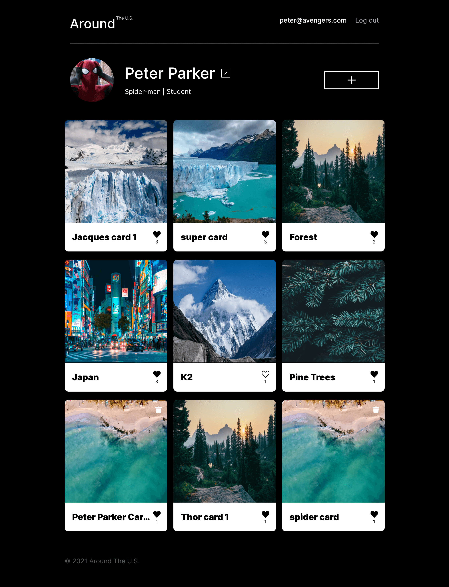

# Hi, I'm Riley Johnston

I'm a full stack web developer. I graduated the Practicum by Yandex web development course in January of 2022. I like building web applications with the MERN stack. I'm also learning C++ through Glendale Community College. I also like riding my bike, podcasts, movies, and all things science/entrepreneurship.
  

## Contact Info
* rileydanejohnston@gmail.com
* [LinkedIn](https://www.linkedin.com/in/rileyjohnston/)
* [AngelList](https://angel.co/u/riley-johnston)
* [Climatebase](https://climatebase.org/profile/57414)
* [Twitter](https://twitter.com/RileyDJohnston)
  

## News Explorer
A news site where users can search for news, create an account and save articles.
* [Live site](https://my-news-explorer.students.nomoreparties.sbs/)
* [Frontend Repo](https://github.com/rileydanejohnston/news-explorer-frontend)
* [Backend Repo](https://github.com/rileydanejohnston/news-explorer-backend)
* Demo - UNDER CONSTRUCTION

  
## Around The U.S
A social media site where users create accounts, post photos, and interact with other user's photos.
* [Live site](https://around-the-us.students.nomoreparties.site/)
* [Repo](https://github.com/rileydanejohnston/react-around-api-full)
* [Demo](https://www.loom.com/share/d4e0d3b5ecb145a9a897f135fe692965)

<!--
**rileydanejohnston/rileydanejohnston** is a ✨ _special_ ✨ repository because its `README.md` (this file) appears on your GitHub profile.

Here are some ideas to get you started:

- 🔭 I’m currently working on ...
- 🌱 I’m currently learning ...
- 👯 I’m looking to collaborate on ...
- 🤔 I’m looking for help with ...
- 💬 Ask me about ...
- 📫 How to reach me: ...
- 😄 Pronouns: ...
- ⚡ Fun fact: ...
-->
